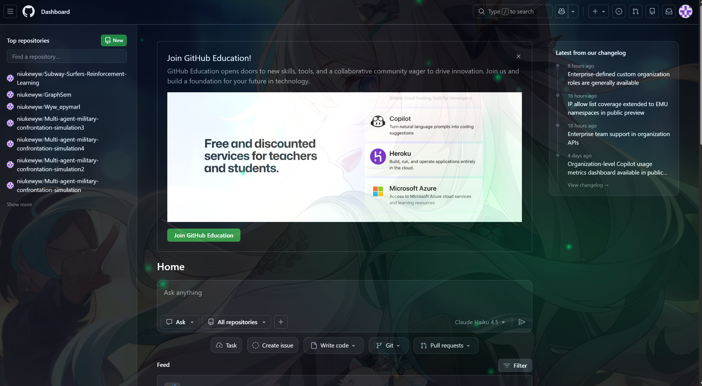
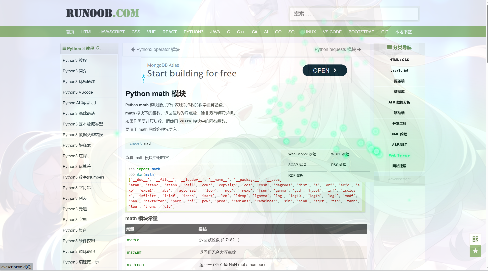

<div align="center">

# ✨ 流萤主题浏览器插件

**让流萤的光芒陪伴你的每一次浏览**

[](LICENSE)
[](https://www.google.com/chrome/)
[](https://www.mozilla.org/firefox/)
[](https://www.microsoft.com/edge)
[](https://zen-browser.app/)

为《崩坏：星穹铁道》中的角色"流萤"打造的浏览器主题插件，以她标志性的萤光绿为色调，带来沉浸式的浏览体验。

**开箱即用，无需任何配置！**

## 🖼️ 效果展示

### 测试页面效果


### 浏览器集成效果


[功能特性](#功能特性) • [安装方法](#安装方法) • [使用说明](#使用说明) • [贡献指南](#贡献指南)

</div>

---

## 📖 项目简介

流萤主题浏览器插件是一款为《崩坏：星穹铁道》粉丝打造的浏览器扩展，将流萤标志性的萤光绿色调带入你的浏览体验。插件通过 Canvas 渲染和 CSS 动态样式，实现了流畅的萤火虫光点拖尾效果和环境粒子系统，让每一次网页浏览都充满梦幻氛围。

### 🎯 开箱即用

- **Chrome/Edge** - 直接加载项目文件夹即可
- **Firefox/Zen** - 使用预构建的 `.xpi` 文件一键安装
- **无需配置** - 不需要 Node.js、npm 或任何构建工具
- **即装即用** - 下载后立即体验流萤的光芒

### 🎯 设计理念

- **沉浸式体验**：通过动态光效和粒子系统，营造流萤陪伴的温馨感
- **性能优先**：使用 Canvas 和 requestAnimationFrame 确保流畅的 60fps 动画
- **高度可定制**：用户可以根据喜好调整亮度、颜色和效果强度
- **全局适配**：自动适配所有网页，无需逐个配置

---

## ✨ 功能特性

### 核心功能

- 🌟 **动态主题色渲染** - 整体界面渲染流萤的标志性萤光绿色调（#00ff88）
- ✨ **萤火虫光点拖尾** - 鼠标移动时产生如萤火虫般的光点拖尾效果
- 🎨 **环境粒子系统** - 背景中飘浮的萤火虫粒子，营造梦幻氛围
- 💡 **智能光晕跟随** - 鼠标周围柔和的光晕效果，增强视觉体验
- 🎯 **全局适配** - 适用于所有网页，自动注入样式和脚本

### 交互效果

- 🔗 **链接发光** - 链接悬停时产生发光效果
- 🔘 **按钮光效** - 按钮悬停时显示光晕和阴影
- 🃏 **卡片效果** - 卡片元素悬停时产生立体光效
- 📱 **响应式设计** - 自动适配不同屏幕尺寸

### 自定义设置

- ⚙️ **启用/禁用效果** - 一键开关萤火虫效果
- 🎚️ **亮度调节** - 自由调节光点亮度
- 📏 **拖尾长度** - 调整拖尾效果的持续时间
- 🖼️ **背景透明度** - 调整背景图片的透明度（0-50%）
- 🎨 **主题颜色** - 自定义主题颜色，不限于萤光绿

---

## 🚀 安装方法

### 前置要求

- Chrome/Edge 88+ 或 Firefox 78+ 浏览器

### 步骤一：获取项目

```bash
# 克隆仓库
git clone https://github.com/yourusername/firefly-theme.git
cd firefly-theme

# 或下载 ZIP 压缩包并解压
```

### 步骤二：加载到浏览器

#### Chrome/Edge 浏览器

1. 打开浏览器，访问 `chrome://extensions/` 或 `edge://extensions/`
2. 开启右上角的"开发者模式"开关
3. 点击"加载已解压的扩展程序"
4. 选择项目的文件夹
5. 插件安装完成！

#### Firefox/Zen 浏览器

**推荐方式：临时加载（已验证可行）**

1. 打开浏览器，访问 `about:debugging#/runtime/this-firefox`
2. 点击"临时载入附加组件"
3. 选择项目中的 `firefly-theme-1.0.3.xpi` 文件
4. 插件加载完成！

**注意**：
- ✅ 临时加载支持直接安装 `.xpi` 文件
- ⚠️ 正式安装（about:addons）可能对未签名的 `.xpi` 文件有限制
- 🔄 如需重新加载，只需重新执行临时加载步骤

---

## 🔨 构建 Firefox/Zen 扩展

如果需要重新构建 Firefox/Zen 的 `.xpi` 文件，可以使用提供的构建脚本。

### 使用构建脚本（推荐）

项目包含 `build-firefox.ps1` 脚本，可以自动完成构建过程：

```powershell
# 运行构建脚本
.\build-firefox.ps1
```

脚本会自动执行以下步骤：
1. ✅ 备份原始的 `manifest.json`
2. ✅ 使用 `manifest_v2.json` 替换 `manifest.json`
3. ✅ 运行 `web-ext build` 生成 `.xpi` 文件
4. ✅ 恢复原始的 `manifest.json`

### 手动构建

如果需要手动构建，请按照以下步骤操作：

```powershell
# 1. 备份原始配置
Copy-Item "manifest.json" "manifest.json.backup"

# 2. 使用 Manifest V2 配置
Copy-Item "manifest_v2.json" "manifest.json" -Force

# 3. 构建 xpi 文件
web-ext build --overwrite-dest --filename=firefly-theme-1.0.3.xpi

# 4. 恢复原始配置
Copy-Item "manifest.json.backup" "manifest.json" -Force
Remove-Item "manifest.json.backup"
```

### 前置要求

构建脚本需要安装 `web-ext` 工具：

```bash
npm install --global web-ext
```

### 构建输出

构建成功后，`.xpi` 文件会生成在：
```
web-ext-artifacts/firefly-theme-1.0.3.xpi
```

---

## 📖 使用说明

### 基本使用

安装后，插件会自动在所有网页上生效。你可以：

1. **移动鼠标** - 观察萤火虫光点拖尾效果
2. **悬停元素** - 体验链接、按钮和卡片的发光效果
3. **观察背景** - 注意环境粒子的漂浮动画

### 自定义设置

1. 点击浏览器工具栏中的插件图标
2. 在设置面板中调整：
   - **启用萤火虫效果** - 开关总效果
   - **光点亮度** - 调节光点亮度（0.2 - 1.0）
   - **拖尾长度** - 调整拖尾持续时间（0.3 - 1.5）
   - **主题颜色** - 选择你喜欢的颜色

### 测试效果

打开项目中的 `test.html` 文件，可以在本地预览所有效果：

```bash
# 在浏览器中打开
start test.html

# 或直接双击文件
```

---

## 🎬 预览效果

### 主题效果

- **萤光绿主色调** - 流萤标志性的 #00ff88 颜色
- **柔和光晕** - 鼠标周围的光晕跟随效果
- **粒子系统** - 背景中漂浮的萤火虫粒子

### 交互效果

- **鼠标拖尾** - 移动鼠标时的光点拖尾动画
- **元素发光** - 链接、按钮悬停时的光效
- **卡片立体** - 卡片悬停时的阴影和光晕

### 性能表现

- **60 FPS 流畅动画** - 使用 requestAnimationFrame 确保
- **低内存占用** - 自动清理过期粒子
- **批量渲染** - Canvas 批量绘制，减少性能开销

---

## 📁 项目结构

```
firefly-theme/
├── manifest.json          # Chrome/Edge 插件配置（Manifest V3）
├── manifest_v2.json       # Firefox/Zen 插件配置（Manifest V2）
├── background.js          # 后台脚本
├── content.js             # 内容脚本（主要功能实现）
├── popup.html             # 设置弹窗界面
├── popup.js              # 设置弹窗脚本
├── styles.css             # 样式文件
├── test.html              # 测试页面
├── build-firefox.ps1      # Firefox/Zen 构建脚本
├── README.md              # 项目说明文档
├── LICENSE                # MIT 许可证
├── CONTRIBUTING.md        # 贡献指南
├── figure1.png            # 效果展示图 1
├── figure2.png            # 效果展示图 2
├── firefly-theme-1.0.3.xpi  # Firefox/Zen 安装包（开箱即用）
├── icons/                 # 图标文件夹
│   ├── icon.svg           # SVG 源图标
│   ├── icon16.png         # 16×16 图标
│   ├── icon48.png         # 48×48 图标
│   └── icon128.png        # 128×128 图标
└── images/                # 背景图片文件夹
    ├── README.md          # 背景图片说明
    └── background.png     # 背景图片（可自行更换）
```

---

## 🔧 技术实现

### 核心技术

- **Canvas 渲染** - 使用 HTML5 Canvas 实现高性能的粒子动画
- **CSS 变量** - 使用 CSS 自定义属性实现动态主题色
- **RequestAnimationFrame** - 使用浏览器原生 API 实现流畅动画
- **Content Script** - 注入到所有页面，实现全局效果

### 跨浏览器支持

- **Chrome/Edge** - 使用 Manifest V3 + `service_worker`
- **Firefox/Zen** - 使用 Manifest V2 + `background.scripts`
- **预构建安装包** - 包含 `.xpi` 文件，开箱即用

### 性能优化

- **批量渲染** - 使用 Canvas 批量绘制，减少 DOM 操作
- **粒子限制** - 限制粒子数量，避免性能问题
- **自动清理** - 自动清理过期粒子，防止内存泄漏
- **智能更新** - 只在必要时更新画布

### 浏览器兼容性

| 浏览器 | 最低版本 | 状态 |
|--------|----------|------|
| Chrome | 88+ | ✅ 完全支持 |
| Edge | 88+ | ✅ 完全支持 |
| Firefox | 78+ | ✅ 完全支持 |
| Safari | 15+ | ⚠️ 部分支持 |
| Opera | 74+ | ✅ 完全支持 |

---

## 📝 更新日志

### v1.0.3 (2026-02-26)

- ⚡ **性能优化**
  - 限制帧率为 30 FPS，降低 CPU 和 GPU 使用率
  - 优化 Canvas 渲染，减少不必要的绘制操作
  - 简化粒子渐变效果，减少 GPU 负载
  - 添加帧间隔控制，避免过度渲染
- 🔧 **技术改进**
  - 使用 `alpha: true` 优化 Canvas 上下文
  - 减少径向渐变的颜色节点数量
  - 跳过不可见粒子的渲染
  - 添加 `hexToRgb` 辅助函数支持动态颜色
- ✅ **兼容性提升**
  - 显著降低低端设备的资源占用
  - 减少风扇噪音和发热问题
  - 保持视觉效果的同时优化性能

### v1.0.2 (2026-02-26)

- 🐛 **修复显示异常问题**
  - 修复部分网页内容被背景图片覆盖的问题
  - 移除干扰网页布局的 CSS 样式
  - 修复 z-index 层级问题
- 🔧 **技术改进**
  - 将 `body::before` 伪元素改为独立的 `.firefly-mouse-glow` 元素
  - 移除 `html` 和 `body` 的全局样式干扰
  - 使用最大 z-index 值确保效果在最上层但不影响交互
  - 优化元素创建和清理逻辑
- ✅ **兼容性提升**
  - 确保所有网页内容正常显示
  - 背景图片和光晕效果不影响网页交互
  - 插件效果与网页内容完全分离

### v1.0.1 (2026-02-25)

- 🐛 **修复配置保存问题**
  - 修复启用/禁用开关无法点击的问题
  - 修复设置无法持久保存的问题
  - 修复设置更改不生效的问题
- 🔧 **技术改进**
  - 将 popup.html 中的内联脚本提取到 popup.js
  - 解决 Manifest V3 的 CSP（内容安全策略）限制
  - 添加详细的调试日志，方便问题排查
  - 优化设置加载和保存逻辑
- ✅ **功能增强**
  - 所有设置现在可以实时保存和加载
  - 页面刷新后设置自动恢复
  - 浏览器重启后设置仍然有效
  - 设置更改立即生效，无需刷新页面

### v1.0.0 (2026-02-24)

- ✨ 初始版本发布
- 🌟 实现萤火虫光点拖尾效果
- 🎨 添加动态主题色渲染
- ⚙️ 支持自定义设置
- 🎯 全局适配所有网页
- 🌌 添加半透明背景图片支持
- 📦 包含预构建的 Firefox/Zen .xpi 安装包
- 🎯 开箱即用，无需配置

---

## 📄 许可证

本项目采用 MIT 许可证 - 详见 [LICENSE](LICENSE) 文件

---

## 🙏 致谢

- 本插件为《崩坏：星穹铁道》角色"流萤"的粉丝向作品
- 感谢米哈游创造了如此迷人的角色
- 感谢所有贡献者和使用者的支持

---

## 📮 联系方式

- 项目主页：[https://github.com/niukewyw/firefly-theme](https://github.com/niukewyw/firefly-theme)
- 问题反馈：[Issues](https://github.com/niukewyw/firefly-theme/issues)
- 邮箱：3177461569@qq.com

---

<div align="center">

**如果这个项目对你有帮助，请给一个 ⭐️ Star！**

Made with ❤️ by [Niukewyw](https://github.com/niukewyw)

</div>
